# Rusty 2.0 - Vollständige Repository Dokumentation

---

## 1. Was ist dieses Projekt?

**Rusty 2.0** ist ein **autonomer Entwicklungs-Assistent**. Das bedeutet:

- Du gibst ihm eine Aufgabe (z.B. "Fix den Bug in auth.py")
- Er analysiert den Code selbstständig
- Er macht Änderungen
- Er prüft ob es funktioniert

Der Agent nutzt dafür ein **Large Language Model (LLM)** wie ChatGPT oder Google Gemini, kombiniert mit **Tools** die ihm erlauben, Dateien zu lesen, zu ändern und Git-Befehle auszuführen.

---

## 2. Die Grundidee (Konzept)

### Warum braucht ein LLM Tools?

Ein LLM wie ChatGPT kann nur Text generieren. Es kann nicht:
- Dateien auf deinem Computer lesen
- Code ausführen
- Git-Befehle ausführen

**Lösung:** Wir geben dem LLM "Tools" (Funktionen), die es aufrufen kann.

### Der Agent-Loop

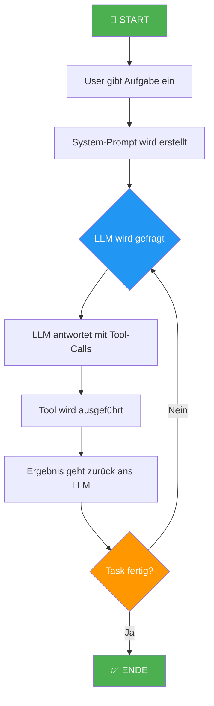

### Vereinfachter Ablauf

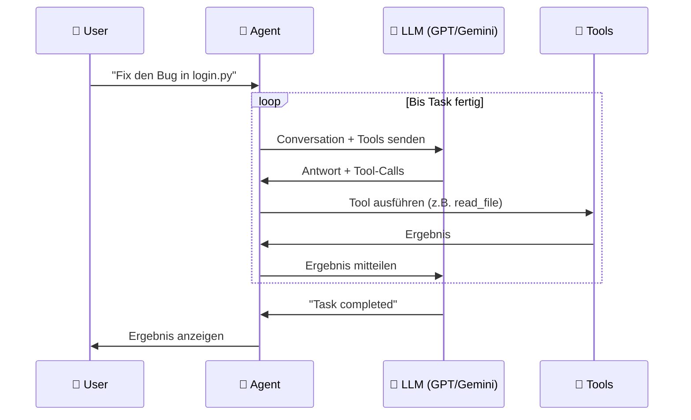

---

## 3. Architektur-Überblick

Das Projekt besteht aus **drei Schichten**:

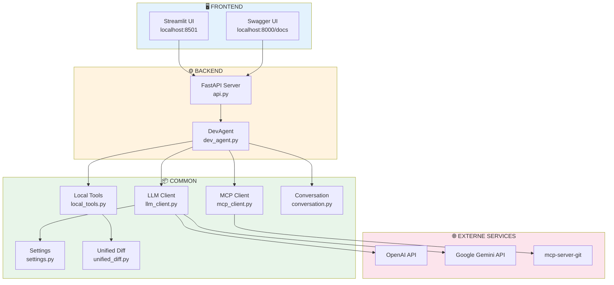

---

## 4. Ordnerstruktur

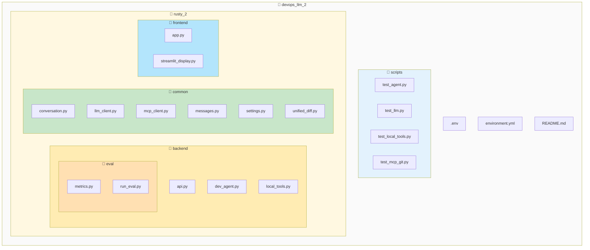

### Datei-Übersicht

| Datei | Beschreibung |
|-------|--------------|
| `.env` | API Keys (NICHT in Git!) |
| `environment.yml` | Conda Dependencies |
| `api.py` | FastAPI Server |
| `dev_agent.py` | Kern-Agent-Logik |
| `local_tools.py` | read_file, apply_diff |
| `llm_client.py` | OpenAI/Gemini Abstraktion |
| `mcp_client.py` | Git-Tools via MCP |
| `conversation.py` | Chat-Verlauf Management |
| `app.py` | Streamlit Frontend |

---

## 5. Detaillierte Datei-Erklärungen

### 5.1 Backend-Dateien

---

#### `api.py` - Der FastAPI Server

**Pfad:** `rusty_2/backend/api.py`

**Was macht diese Datei?**
Sie stellt eine REST-API bereit, über die der Agent gestartet werden kann.

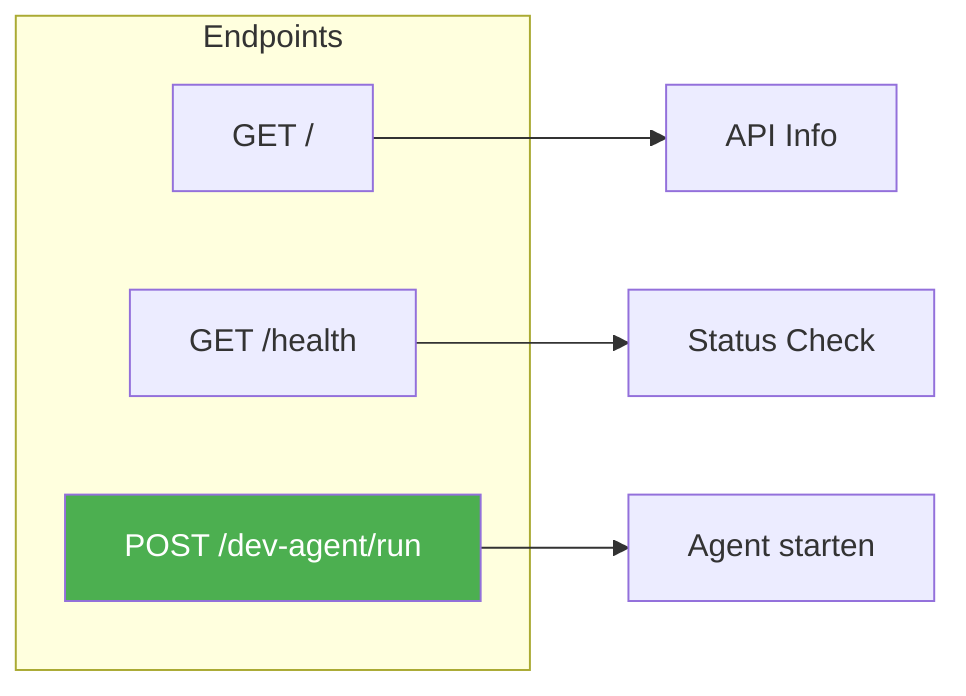

**Request-Struktur:**

```python
class DevAgentRunRequest:
    task_description: str      # Was soll der Agent tun?
    repo_root: str             # Pfad zum Repository
    git_mcp_url: str           # URL für den Git MCP Server
    max_steps: int = 20        # Maximale Anzahl Schritte
```

---

#### `dev_agent.py` - Das Herzstück

**Pfad:** `rusty_2/backend/dev_agent.py`

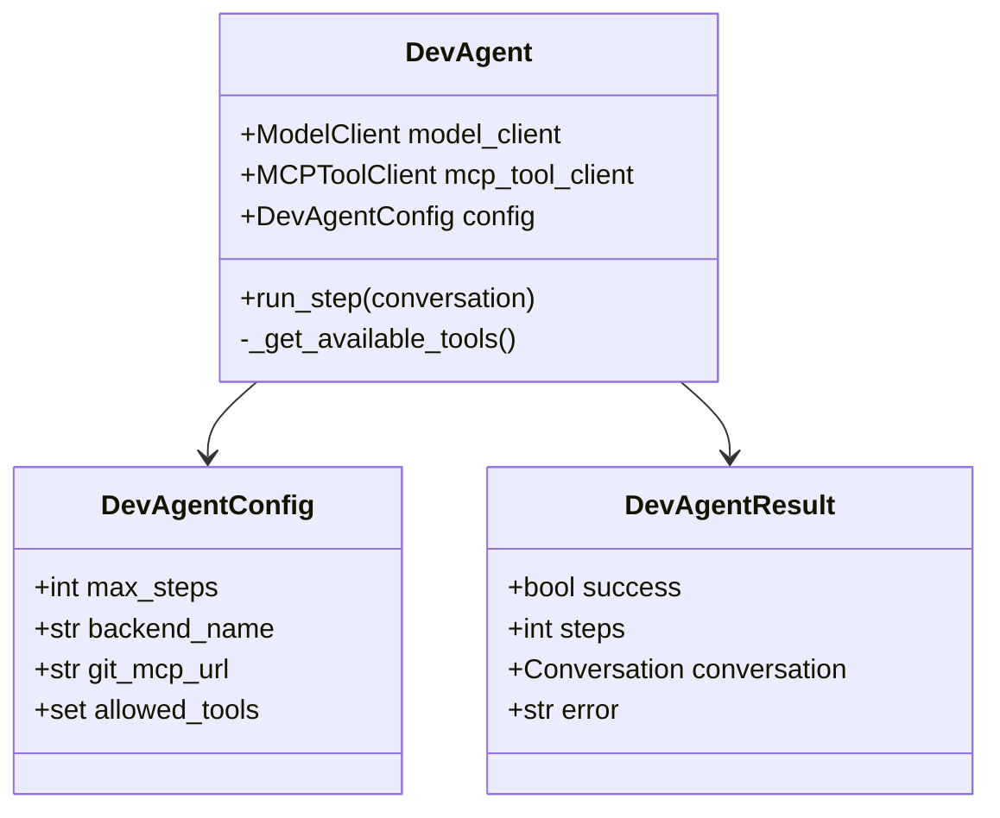

**Der run_step() Ablauf:**

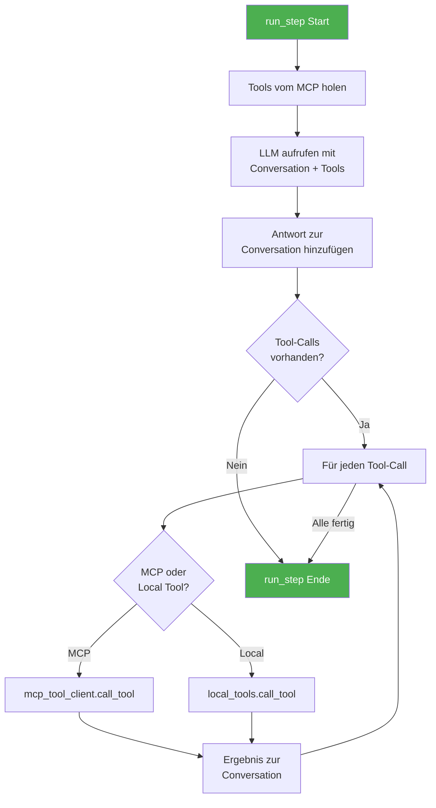

---

#### `local_tools.py` - Datei-Operationen

**Verfügbare Tools:**

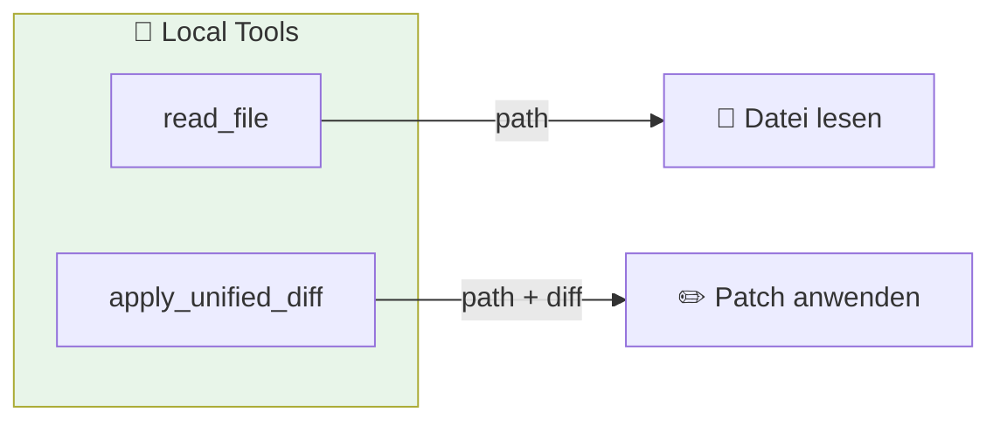

**Sicherheits-Check:**

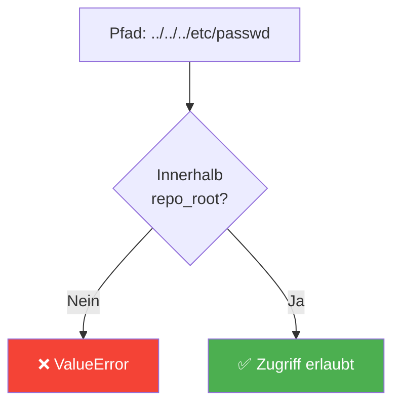

---

### 5.2 Common-Dateien

---

#### `llm_client.py` - LLM Kommunikation

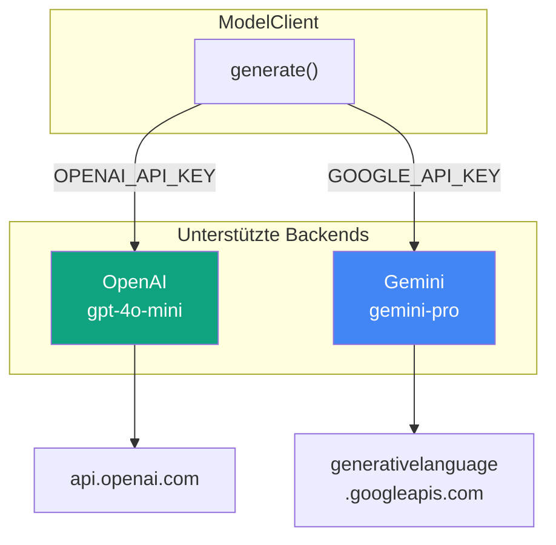

**Rate-Limiting:**

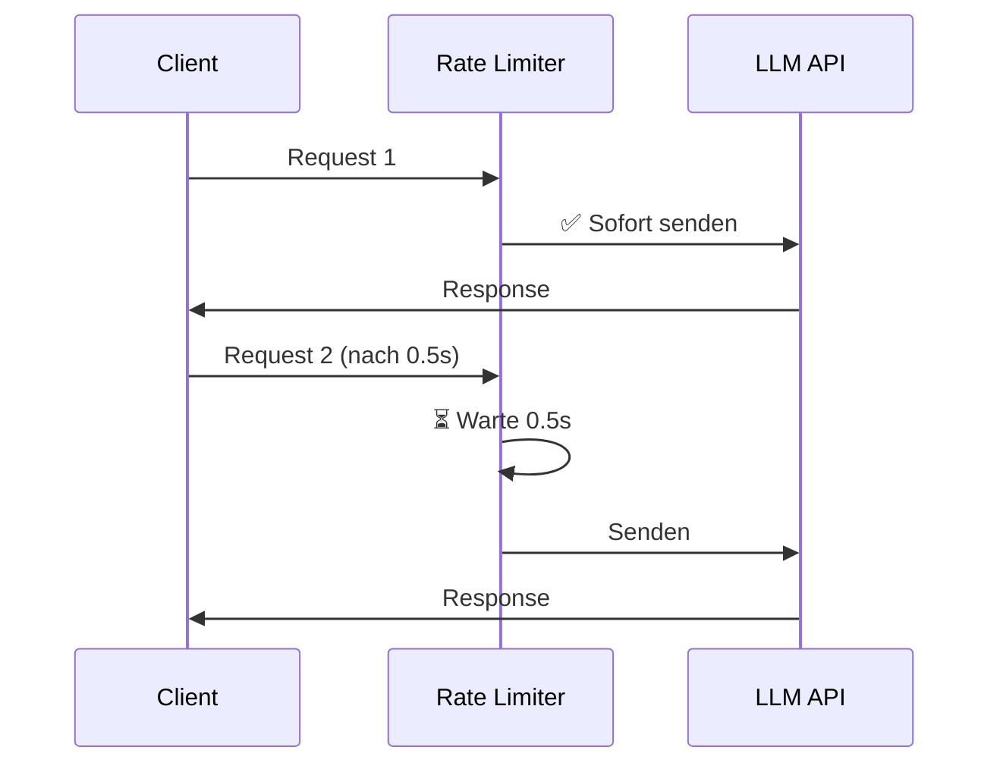

---

#### `mcp_client.py` - Git-Tool Anbindung

**Was ist MCP?**

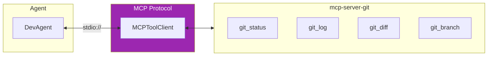

**Verfügbare Git-Tools:**

| Tool | Beschreibung |
|------|--------------|
| `git_status` | Zeigt geänderte Dateien |
| `git_log` | Zeigt Commit-Historie |
| `git_diff` | Zeigt Änderungen |
| `git_show` | Zeigt einen Commit |
| `git_branch_list` | Listet Branches |

---

#### `conversation.py` - Chat-Verlauf

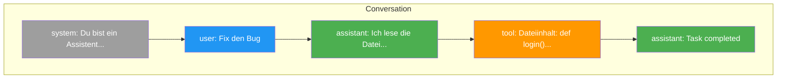

**Message-Rollen:**

| Rolle | Farbe | Bedeutung |
|-------|-------|-----------|
| `system` | 🔘 Grau | Anweisungen für das LLM |
| `user` | 🔵 Blau | Nachrichten vom Benutzer |
| `assistant` | 🟢 Grün | Antworten vom LLM |
| `tool` | 🟠 Orange | Ergebnisse von Tool-Aufrufen |

---

#### `unified_diff.py` - Code-Änderungen

**Was ist ein Unified Diff?**

```diff
--- original.py
+++ modified.py
@@ -10,7 +10,8 @@
 def calculate_total(items):
     total = 0
     for item in items:
-        total += item.price
+        total += item.price * item.quantity
+    total = round(total, 2)
     return total
```

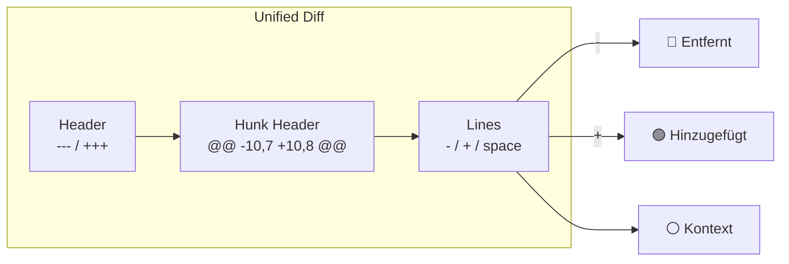

---

### 5.3 Frontend-Dateien

---

#### `app.py` - Streamlit Hauptanwendung

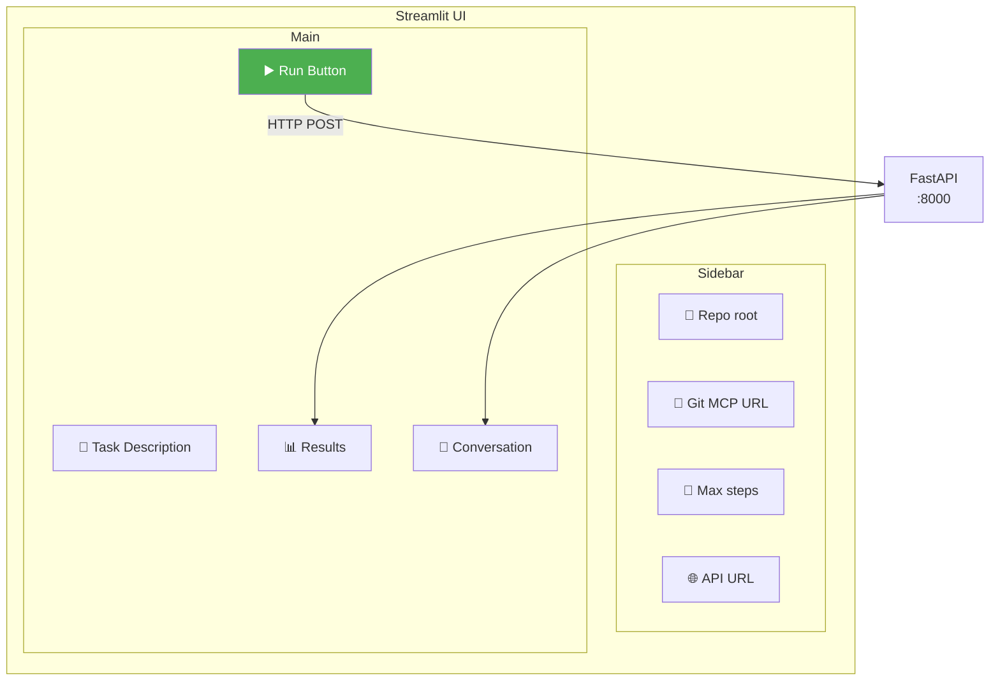

---

### 5.4 Evaluations-Framework

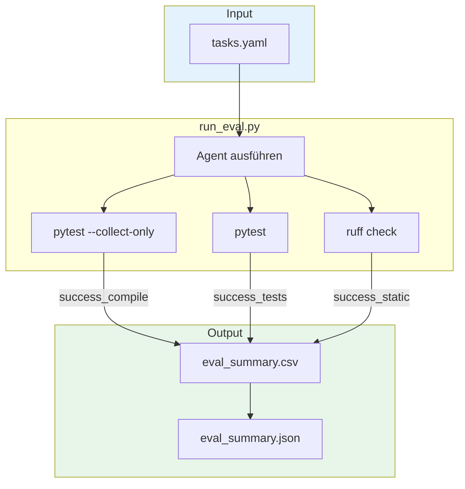

**Metriken:**

| Metrik | Beschreibung | Check |
|--------|--------------|-------|
| `success_compile` | Kompiliert? | `pytest --collect-only` |
| `success_tests` | Tests grün? | `pytest` |
| `success_static` | Linter OK? | `ruff` / `flake8` |
| `success_behaviour` | Aufgabe gelöst? | Tests bestanden |
| `steps` | Schritte | Zähler |

---

## 6. Verwendete Pakete

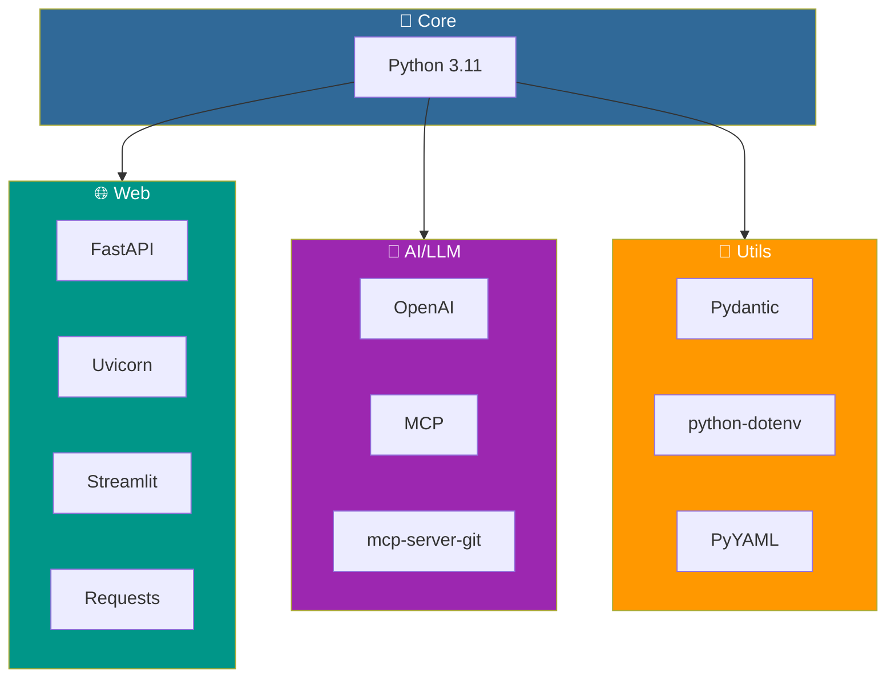

---

## 7. Kompletter Datenfluss

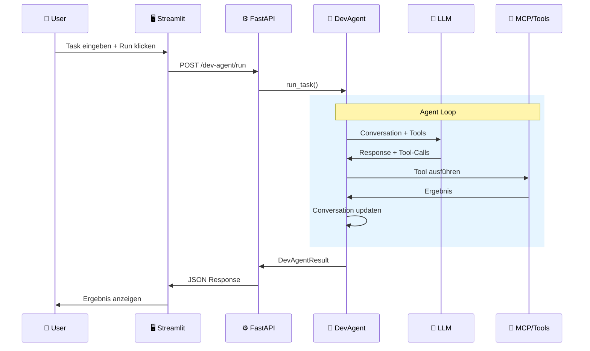

---

## 8. Glossar

| Begriff | Erklärung |
|---------|-----------|
| **LLM** | Large Language Model - KI-Modell das Text versteht und generiert |
| **API** | Application Programming Interface - Schnittstelle für Services |
| **MCP** | Model Context Protocol - Anthropic's Protokoll für Tool-Anbindung |
| **Tool-Calling** | Feature von LLMs, externe Funktionen aufzurufen |
| **Agent** | Autonomes System: LLM + Tools + Loop |
| **Conversation** | Chat-Verlauf zwischen User, LLM und Tools |
| **System-Prompt** | Anweisungen die dem LLM sagen, wie es sich verhalten soll |
| **Unified Diff** | Standard-Format für Code-Änderungen |
| **Rate-Limiting** | Begrenzung der API-Anfragen pro Zeiteinheit |
| **FastAPI** | Modernes Python Web-Framework |
| **Streamlit** | Python Framework für Web-UIs |
| **Conda** | Paket- und Environment-Manager |

---

## 9. Quick Reference

### Befehle

```bash
# Environment aktivieren
conda activate rusty_2

# Backend starten
uvicorn rusty_2.backend.api:app --reload

# Frontend starten
streamlit run rusty_2/frontend/app.py

# LLM-Verbindung testen
python scripts/test_llm.py

# Agent testen
python scripts/test_agent.py

# Evaluation durchführen
python -m rusty_2.backend.eval.run_eval --tasks tasks.yaml
```

### URLs

| URL | Beschreibung |
|-----|--------------|
| http://localhost:8000 | FastAPI Backend |
| http://localhost:8000/docs | Swagger UI |
| http://localhost:8501 | Streamlit Frontend |

### Wichtige Dateien

| Datei | Beschreibung |
|-------|--------------|
| `.env` | API Keys (nicht in Git) |
| `environment.yml` | Conda Dependencies |
| `tasks.yaml` | Evaluations-Tasks |

---

*Dokumentation erstellt für DevOps & LLMs - HSLU Master*
*Stand: Dezember 2024*
